## Análise assistida por IA 

**IA escolhida:** ChatGPT

Foi solicitado a Inteligencia Artificial uma analise assistida, com base no prompt:

>Leia os dados e pegue a media de cada campo citado e utilize a media para validar se está dentros dos valores minimos e maximos, e com esses resultados, defina se a nave está pronta para decolar ou nao.
>
>- temperatura interna:
>  - minimo: 18
>  - maximo: 26
>- temperatura externa:
>  - minimo: -100
>  - maximo: 100
>- integridade estrutural:
>  - minimo: 1
>  - maximo: 1
>- Nível de energia:
>  - minimo: 50
>  - maximo: 100
>- pressão dos tanques:
>  - minimo: 100
>  - maximo: 140
>- status dos modulos criticos:
>  - minimo: 1
>  - maximo: 1

Foram realizados testes com dois datasets diferentes, um que obtinha um resultado positivo e portanto indicava a possibilidade de decolagem, e um que resultava negativamente, abortando a missão

### Resultado Positivo - Algoritmo

Conforme demonstrado no fluxograma anterior, o algoritmo demonstra todos os relatórios em tela com todos os cálculos feitos:

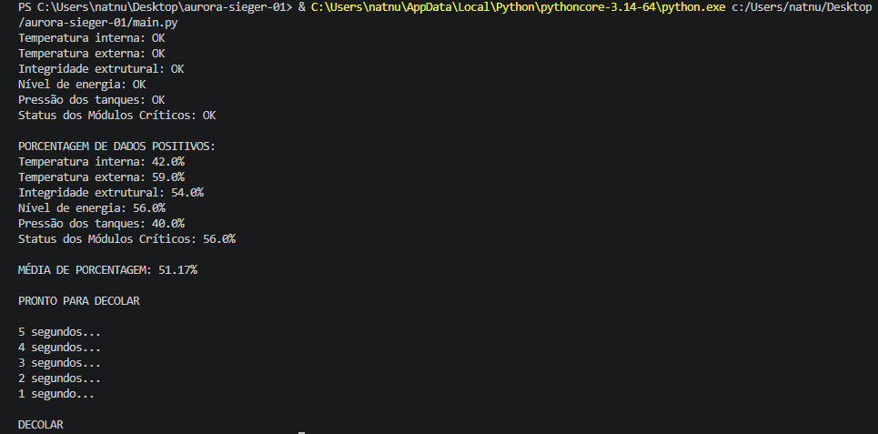

### Resultado Positivo - IA

Conforme o prompt descrito, a IA realizou sua análise de forma similar ao previsto no fluxograma, se aproximando da ideia central do projeto sem que houvesse contato com o algoritmo feito à mão, apresentando um resultado semelhante, evidenciando assim uma consistência entre as duas análises seguindo as mesmas regras de negócio:

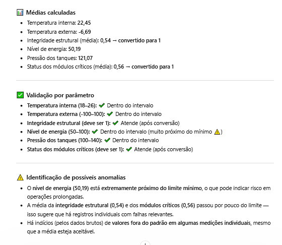

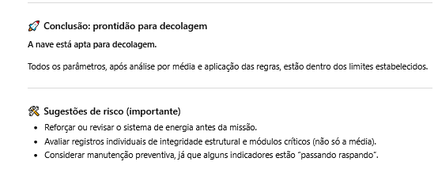

### Resultado Negativo - Algoritmo

Utilizando um dataset com valores inadequados, é previsto que a tomada de decisão opte pelo caminho negativo do fluxo, mostrando em tela todos os relatórios e a decisão final de abortar a decolagem:

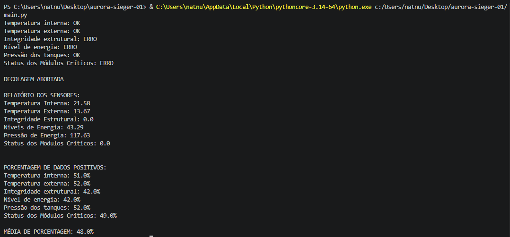

### Resultado Negativo - IA

Utilizando as mesmas regras e o mesmo prompt, a IA realizou a análise do mesmo dataset falho seguindo as mesmas regras de negócio, sendo esperado o resultado negativo conforme apresentado no fluxograma. Nesse cenário, essa análise teve o retorno esperado, corroborando para a consistência mais uma vez:

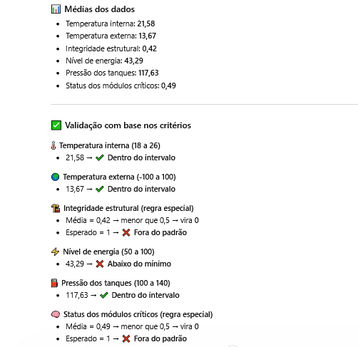

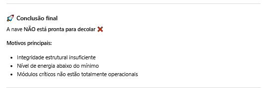

### Classificação dos dados

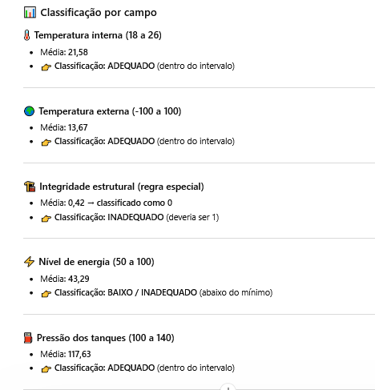

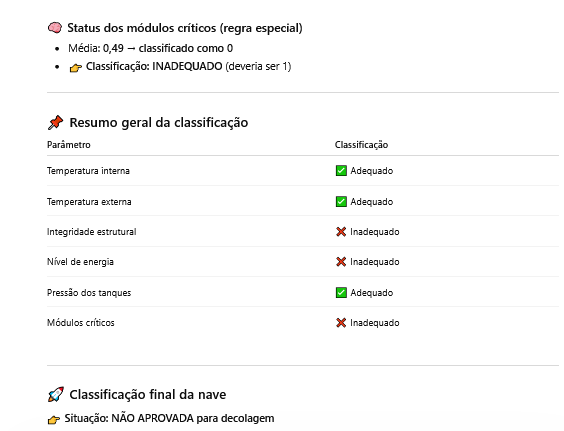

### Identificação de Possíveis Anomalias

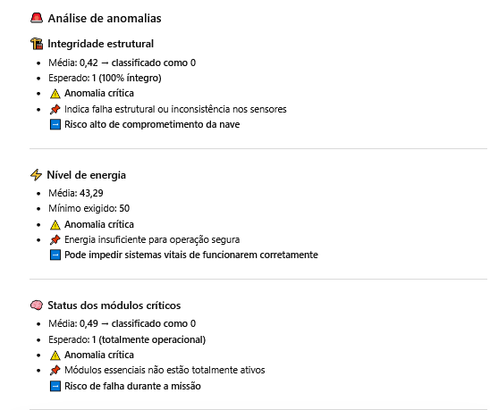

### Sugestão de Risco

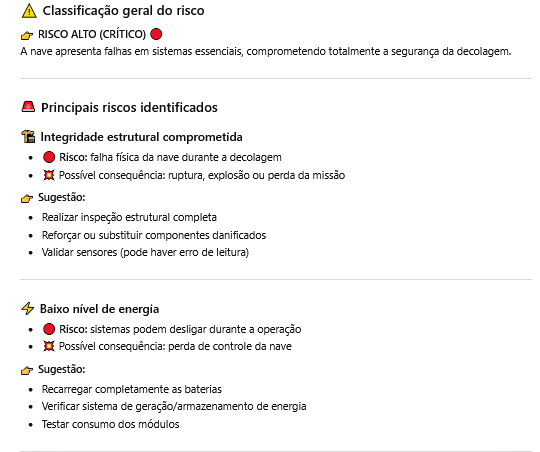

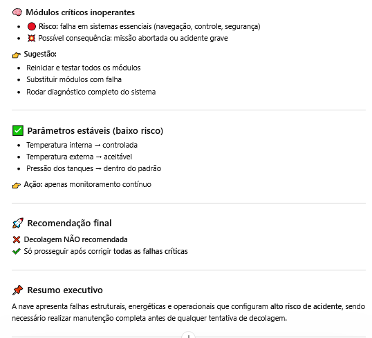

## Analise Energetica

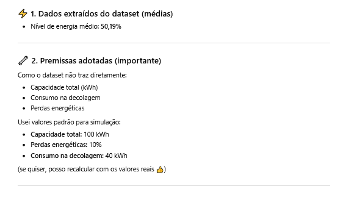

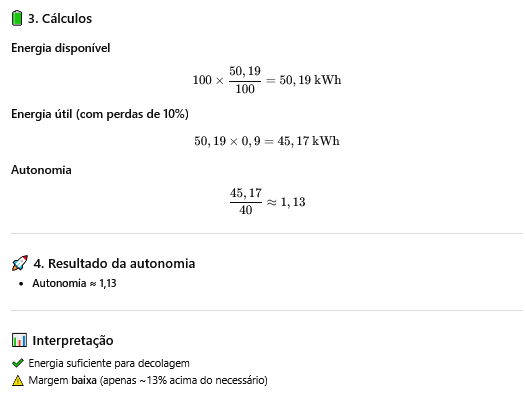

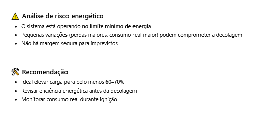

##  Reflexão crítica

A exploração espacial é uma das maiores inovações dos ultimos anos, devido ao avanço da tecnologia, foi ficando mais fácil investigar o universo desconhecido ao nosso redor.
Entretanto, é necessário o planejamento para identificar quaisquers erros para não extrapolar as regulamentações.
Algumas discussões éticas envolvem pautas sobre a questão do descarte de lixo no espaço, da apropriação de recursos extraterrestres e etc.., ambos são motivos para cooperação internacional, tendo que, as agências agirem de forma transparente e com compromisso para não poluir o meio ambiente espacial.
O impacto social envolve a questão do amplo conhecimento que adquirimos nas explorações, entretanto sendo raso pela desigualdade e ausência de investimentos em operações espaciais.
E por fim, a  sustentabilidade tecnológica é o ponto central, visando o uso consciente e sustentável para soluções reutilizáveis, como por exemplo, foguetes reaproveitaveis. É de devida importância também preservar e diminuir o impacto ambienteal espacial para futuramente prosseguir com novas explorações.
Portanto, a exploração espacial não deve ser vista apenas como conquista tecnológica, mas sim como uma responsabilidade coletiva. Tendo como necessidade a integração de ética, pensamento no impacto social e planejamento da sustentabilidade, resultando na capacidade de alcançar de forma justa e consciente o conhecimento por meio das explorações.
